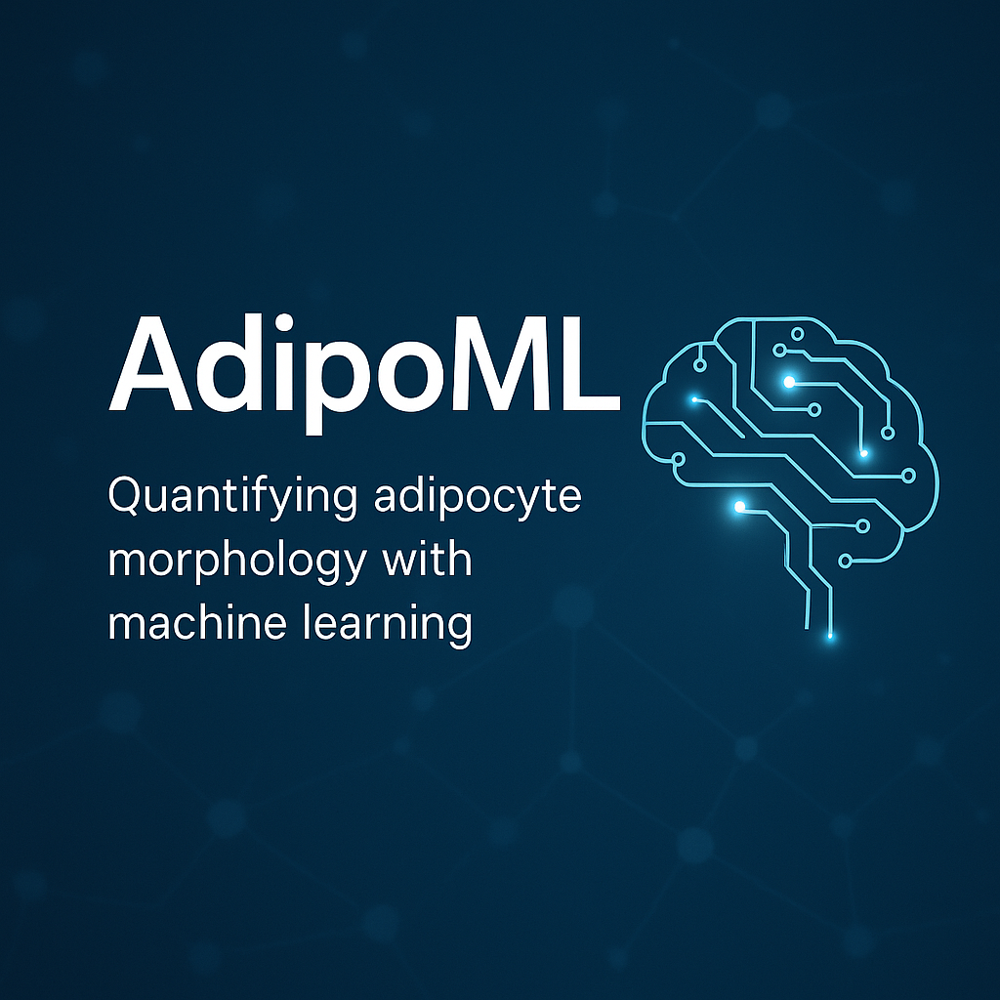

# adipo-ml 🔬🧪🧫

Scaling adipocyte morphology (SAM)

From pixels to phenotypes: adipocyte size made measurable. A machine learning solution for classifying adiopocyte microscopy images. 




## Getting Started

```
cd /backend

# set python version for env
pyenv local 3.10.13`

# start virtual env
# py -m venv venv
/Users/ladams/.pyenv/versions/3.10.13/bin/python3.10 -m venv env

source env/bin/activate 

# verify in virtual env:
echo $VIRTUAL_ENV
# will return a file path to your venv

# create symlink to certifcate bundle
# necessary to install nltk
/Applications/Python\ 3.13/Install\ Certificates.command

# copy .env file and set your own values
mv .env-template .env

# install deps
pip install -r requirements.txt
# pip install numpy pandas matplotlib scikit-learn torch torchvision
```

## Technical Approach

🧪 Use PyTorch if you want:
More control and flexibility for custom model architectures or loss functions (e.g., pixel-wise operations, segmentation, or hybrid tasks)

Easier integration with scientific Python ecosystem (NumPy, scikit-image, MONAI)

A framework that’s favored in academic research, especially in computer vision and medical imaging

Native support for multilabel tasks using BCEWithLogitsLoss

✅ Recommended for:

Custom microscopy pipelines

Research prototyping

Complex models (e.g., U-Net, attention-based models)

🤖 Use TensorFlow/Keras if you want:
High-level API with quicker prototyping via model.fit(), built-in metrics, and callbacks

Better multi-GPU or TPU integration (out of the box)

Native integration with TensorBoard for tracking and visualization

Easy deployment with TF Lite or TensorFlow Serving

✅ Recommended for:

Rapid development

Models that will be productionized

Teams already using the TensorFlow ecosystem
